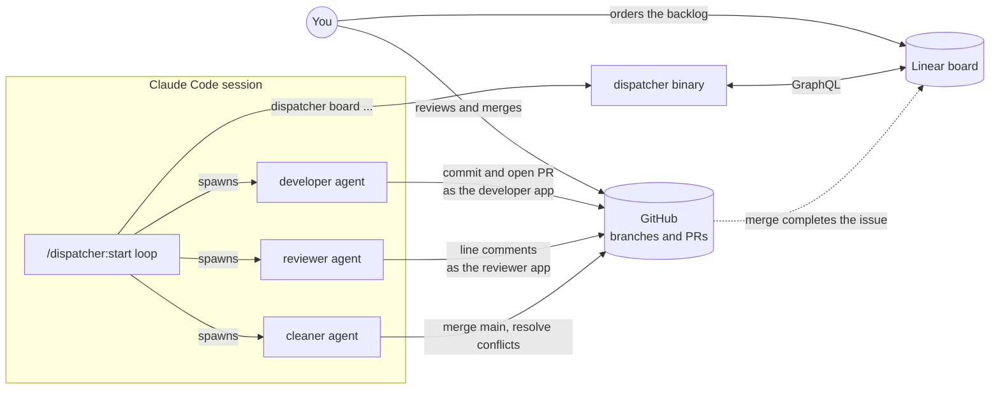
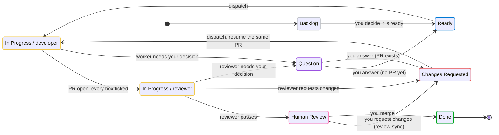

# dispatcher

An autonomous backlog dispatcher for agent-driven development: a long-running
Claude Code session works your Linear (or GitHub Projects) board top to bottom,
handing each task to a fresh developer agent, each finished pull request to an
adversarial reviewer agent, and each conflicting PR to a cleaner agent, while
you keep the two jobs that matter - ordering the backlog and merging.

Everything ships as one self-contained `dispatcher` binary per platform plus a
Claude Code plugin; a committed `dispatcher.config.json` at your repository
root is the only project-specific piece. Full documentation with flow charts
lives at **https://backside4charter.github.io/dispatcher/**.



## Install and use

1. **Install the binary** (one line per platform; pin a release with
   `DISPATCHER_VERSION=x.y.z`):

   ```powershell
   # Windows
   powershell -ExecutionPolicy Bypass -c "irm https://raw.githubusercontent.com/backside4charter/dispatcher/main/install.ps1 | iex"
   ```

   ```sh
   # macOS / Linux
   curl -fsSL https://raw.githubusercontent.com/backside4charter/dispatcher/main/install.sh | sh
   ```

2. **Put your Linear API key on the machine.** Either export
   `LINEAR_API_KEY`, or save `{"Linear": "lin_api_..."}` as
   `.secrets/api-keys.json` in your repository (the directory is gitignored).
   The key comes from Linear > Settings > Account > Security & access.

3. **Run the setup wizard inside your repository:**

   ```sh
   cd your-repo
   dispatcher init
   ```

   With the API key present, teams, projects and workflow states are pickers.
   The wizard writes `dispatcher.config.json`, enables the Claude Code plugin
   in `.claude/settings.json`, and prints a checklist of anything still
   missing (the `gh` CLI, the GitHub App keys, the webhook extension).

4. **Fill in the two `TODO` agent ids** in the `linear.agents` section of the
   config (see [What to set up in Linear](#what-to-set-up-in-linear)), and, if
   you want bot-authored commits and reviews, the `githubApps` section
   (see the [GitHub Apps guide](https://backside4charter.github.io/dispatcher/setup/github-apps)).
   Confirm with:

   ```sh
   dispatcher board config
   dispatcher board poll <milestone>
   ```

5. **Optionally start the event channel** in its own terminal so board and
   PR changes wake the loop immediately instead of at its polling interval:

   ```sh
   dispatcher listen
   ```

6. **Start the loop** in a Claude Code session opened at your repository:

   ```
   /dispatcher:start v1.1.0
   ```

   Name one or more milestones. The dispatcher polls, claims, spawns workers,
   verifies their pull requests, and reports in its status text. Stop it with
   `/dispatcher:stop` (drain) or `/dispatcher:stop now` (abort). Everything
   durable lives on the board and on GitHub, so stopping loses nothing.

Prefer manual installation? Download a binary from
[Releases](https://github.com/backside4charter/dispatcher/releases)
(`windows-x64`, `linux-x64`, `linux-arm64`, `darwin-x64`, `darwin-arm64`) and
run `dispatcher help`.

## How it works

### The board is the state machine

Tasks are issues in one Linear project. The dispatcher works a set of
milestones in the board's manual order, which is your priority signal. Every
issue moves through seven workflow states; your team can call them anything,
the config maps each name onto its role.



- **`Ready`** means never worked on; **`Changes Requested`** means worked on
  and sent back, so it always has an open PR to resume. Changes Requested
  outranks Ready.
- **`Backlog`** and **`Question`** are yours: the dispatcher never dispatches
  them. A worker that hits a decision only you can make parks its task in
  Question with the question as an issue comment.
- **`Human Review`** means a PR is waiting on you. **`Done`** is written by
  your merge, through Linear's GitHub automation, never by an agent.
- Which agent phase a row is in while `In Progress` is carried by Linear's
  **delegate**, not by the state. A **claim** (one comment on the issue naming
  the role, the Claude session and a timestamp) says which session is working
  it right now and doubles as a heartbeat; claims older than 90 minutes are
  treated as a dead session's and taken over.

### A dispatcher session and three kinds of worker

The dispatcher session is deliberately lightweight: it polls the board, claims
a row, spawns a worker in a fresh context, verifies the result against GitHub,
updates the board, and paces itself. Workers never touch board state.

| Worker | Takes | Produces | In flight |
| --- | --- | --- | --- |
| `developer` | a `Ready` or `Changes Requested` issue | one branch, one PR into `main`, in its own git worktree | up to 2 |
| `reviewer` | a row delegated to the reviewer with an open PR | line-anchored findings on the PR and a `PASS` / `CHANGES_REQUESTED` / `QUESTION` verdict; never edits code | up to 2 |
| `cleaner` | an open PR that conflicts with `main` | a merge of `main` into the branch with conflicts resolved and nothing lost | 1, in its own slot |

Each loop iteration processes finished workers, re-stamps live claims, tops
up both queues, brings bot-authored PRs up to date with `main`, dispatches the
cleaner at conflicts, scans the whole project for rows stranded by dead
sessions, and prunes finished worktrees. Wakes come from worker completions,
from the event channel, and from a fallback timer.

### Two GitHub App identities

GitHub will not let an account approve its own pull request, so agent work is
committed and opened as a **developer** GitHub App and reviewed as a separate
**reviewer** GitHub App. That keeps every PR reviewable by you and makes the
AI review an independent signal. `dispatcher commit`, `dispatcher pr` and
`dispatcher token --app reviewer` mint short-lived installation tokens from
the apps' private keys; the reviewer only ever posts `COMMENT` reviews, so an
agent can never satisfy a required-approval rule.

### Closing the latency gaps

- **Event channel.** `dispatcher listen` runs a loopback listener fed by the
  official `gh webhook forward` extension (no public ingress) and by a Linear
  poller every 30 seconds. The loop arms `dispatcher wait` in the background
  and treats its exit as a wake. If the channel is down the loop still works,
  at polling latency.
- **Review sync.** A small GitHub Actions workflow runs `dispatcher
  review-sync` on every `pull_request_review`; when you request changes on a
  PR, its issue goes back to `Changes Requested` within seconds, whether or
  not a dispatcher session is awake.

### One binary, every command

| Command | Purpose |
| --- | --- |
| `board <subcommand>` | read and write the board: `config`, `states`, `milestones`, `poll`, `issue`, `claims`, `pr-issues`, `state`, `claim`, `assign`, `release`, `comment`, `label`, `link-pr` |
| `listen` / `status` / `wait` / `consume` | the local event channel |
| `token` / `identity` / `pr` / `commit` | agent GitHub App identity tooling |
| `review-sync` | CI hook: owner change request to `Changes Requested` |
| `prune-worktrees` | remove finished agent worktrees safely |
| `init` | interactive per-repository setup |

## What to set up in Linear

1. **A team and a project.** The project is the board; its manual issue order
   is the priority order. Create **project milestones** (`v1.1.0`, ...); the
   dispatcher is scoped to milestones you name when you start it.
2. **Seven workflow states** on the team, one per role. The defaults the
   wizard offers:

   | Role | Default name | Meaning |
   | --- | --- | --- |
   | `backlog` | Backlog | not to be worked on yet |
   | `ready` | Ready | agent-workable, never worked |
   | `changesRequested` | Changes Requested | sent back, has an open PR |
   | `inProgress` | In Progress | a developer or reviewer holds it |
   | `question` | Question | parked on a decision only you can make |
   | `humanReview` | Human Review | a PR is waiting on you |
   | `done` | Done | merged (a `completed` type state) |

3. **Two labels:** one meaning "check with me before starting" (default
   `Confirm with user`) and one marking design-sensitive work (default `UI`).
4. **Two agent app users** to delegate work to, the developer and the
   reviewer. Each is a Linear OAuth application with agent capabilities,
   installed into the workspace with `actor=app`, after which it appears as a
   user that issues can be delegated to. Put their user ids in
   `linear.agents`; find them with your API key:

   ```graphql
   query { users(filter: { app: { eq: true } }) { nodes { id name displayName } } }
   ```

5. **The GitHub integration**, enabled for the workspace and, per team, the
   automation *PR merged -> Done*. Task branches are named
   `task/<identifier>-<slug>` and PR bodies carry `Fixes <identifier>`, which
   is what links a PR to its issue and lets the merge complete it.
6. **A personal API key** for the account the dispatcher acts as (step 2 of
   the install). Every board write and comment goes out under this account;
   agent comments are tagged `**[developer]**`, `**[reviewer]**`,
   `**[cleaner]**` or `**[dispatcher]**` on their first line.

The [Linear setup guide](https://backside4charter.github.io/dispatcher/setup/linear)
walks through each of these step by step, and the
[GitHub Projects guide](https://backside4charter.github.io/dispatcher/setup/github-projects)
covers the alternative backend.

## Configure

`dispatcher.config.json` at the repository root is committed and is also the
marker the binary locates the repository by. It names the platform, the
project, what the team calls each state and label, the repository PRs land in,
the two agent identities on each side, and optionally the listener port. See
the [config reference](https://backside4charter.github.io/dispatcher/reference/config)
for every field, or [src/testing/board-fixtures.ts](src/testing/board-fixtures.ts)
for a complete fictional example.

Credentials are looked up, never configured: the Linear API key from
`LINEAR_API_KEY` or `.secrets/api-keys.json`, GitHub board access through
your `gh` auth, and each GitHub App's private key from
`.secrets/<slug>.private-key.pem` (or the environment variable named in its
config entry).

## Build from source

Requires [Bun](https://bun.sh) at the version pinned in `.bun-version`
(compiled binaries embed the compiling runtime, so the pin is exact) and
optionally [just](https://github.com/casey/just).

```sh
bun install
just check          # typecheck + tests
just run board config
just compile        # host-platform binary into dist/
just compile all    # every target (cross-compiles from any host)
just docs           # serve the documentation site locally
```

The documentation site is a Docusaurus project under `website/`, deployed to
GitHub Pages by the `docs` workflow on every push to `main`.

Releases are cut by tagging: bump `package.json`, tag `v<version>`, push the
tag, and the release workflow compiles every target and publishes the
binaries.
