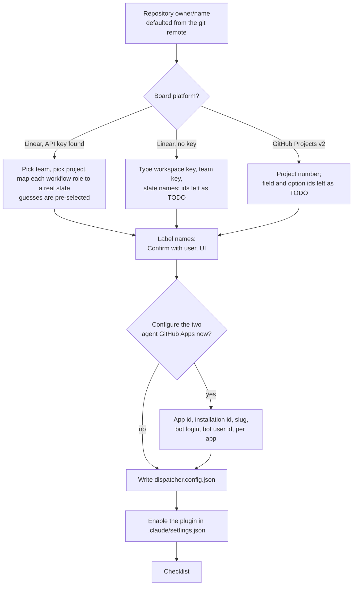

# Set up a repository with `dispatcher init`

One command takes a repository from nothing to dispatcher-ready. Run it at the
root of the repository the pull requests will land in:

```sh
cd your-repo
dispatcher init
```

It does three things, each idempotent, so it is safe to run again at any time:

1. **Creates `dispatcher.config.json`** by asking questions. With a Linear API
   key on the machine, the painful values (team and project ids, workflow
   state names) are pickers rather than UUID entry. An existing config is kept,
   never overwritten.
2. **Enables the Claude Code plugin** in `.claude/settings.json`, adding the
   `dispatcher` marketplace (`backside4charter/dispatcher` on GitHub) and
   turning on `dispatcher@dispatcher`. Everything else in the file is
   preserved. A running Claude Code session picks the plugin up after a
   restart.
3. **Prints a checklist** of the tools and credentials the config needs, with
   the fix for each one that is missing.

## Before you run it

Put the Linear API key where the binary looks for it, so the wizard can list
your teams and states instead of asking for ids:

- `LINEAR_API_KEY` in the environment, or
- `.secrets/api-keys.json` at the repository root, containing
  `{"Linear": "lin_api_..."}`. The `.secrets/` directory should be gitignored;
  it is the same place the GitHub App private keys go.

Create the key under Linear > Settings > Account > Security & access. See
[Credentials](../reference/credentials.md) for how every credential is found.

## The questions



The state mapping step shows your team's real workflow states and asks which
one plays each of the seven roles (`backlog`, `ready`, `changesRequested`,
`inProgress`, `question`, `humanReview`, `done`). The guess is by name first
("Changes Requested", "In Progress", ...) and by Linear's state category
second, so a team with conventional names confirms seven defaults with Enter.
Every role must map to a state; see [The board model](../in-depth/board-model.md)
for what each one means and [Set up Linear](../setup/linear.md) for creating
the states if your team does not have them yet.

## After it finishes

The config is complete except for two values the wizard cannot discover:

- **`linear.agents.developer` and `linear.agents.reviewer`** are written as
  `TODO`. They are the Linear user ids of the two agent app users task rows
  are delegated to. Claims fail loudly until they are set. [Set up
  Linear](../setup/linear.md#5-agent-app-users) shows how to create the app
  users and find their ids.
- **`githubApps`** is present only if you answered yes to the apps question.
  You can add it later by hand; the [GitHub Apps guide](../setup/github-apps.md)
  lists every field.

Then verify:

```sh
dispatcher board config          # the resolved platform, project, states and labels
dispatcher board states          # the team's live states with the role each plays
dispatcher board milestones      # milestones with open-issue counts
dispatcher board poll <milestone>
```

`board config` fails with every schema violation listed at once if the file
is not valid, naming the field.

## Running it non-interactively

When there is nothing to ask (the config exists and the plugin is already
enabled) `init` prompts for nothing, so it doubles as a scriptable verifier:
it prints the checklist and exits 0. A run that would need to ask a question
without a terminal exits 1 and says so.

## What the checklist covers

| Check | When it applies | Fix |
| --- | --- | --- |
| GitHub CLI (`gh`) | always | install it and `gh auth login` |
| `gh webhook` extension | always, marked optional | `gh extension install cli/gh-webhook` and `gh auth refresh -h github.com -s admin:org_hook` |
| Claude Code CLI | always | install it |
| Linear API key | platform is `linear` | set `LINEAR_API_KEY` or write `.secrets/api-keys.json` |
| developer / reviewer app private key | `githubApps` is configured | save the PEM as `.secrets/<slug>.private-key.pem` or set the app's key environment variable |

## Next

[Start the loop](first-run.md), or do the one-time
[Linear](../setup/linear.md) and [GitHub Apps](../setup/github-apps.md)
setup first if you have not yet.
