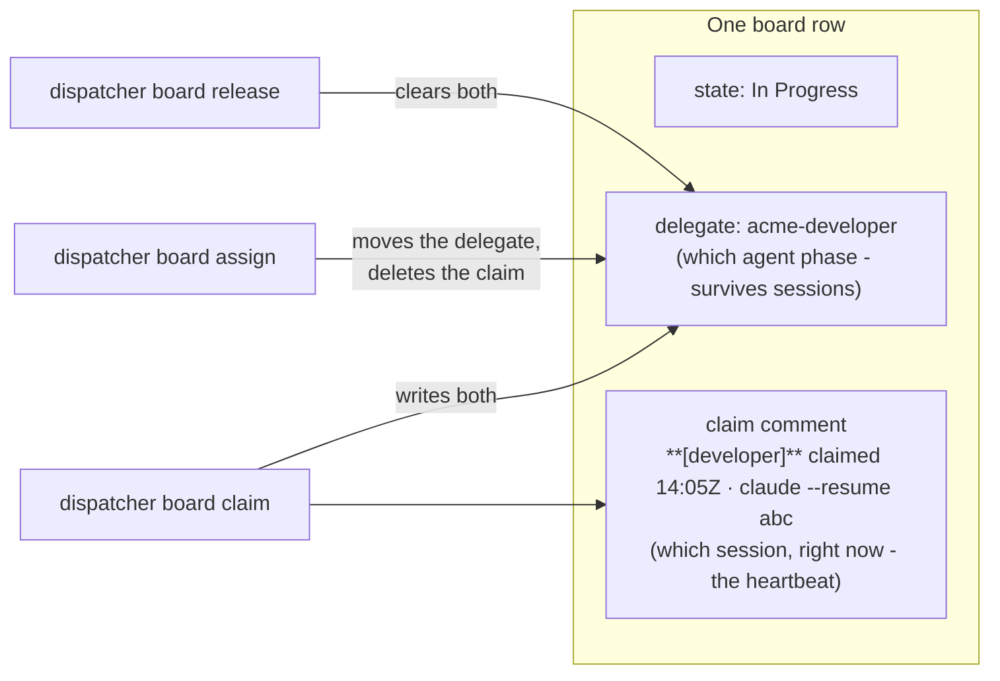
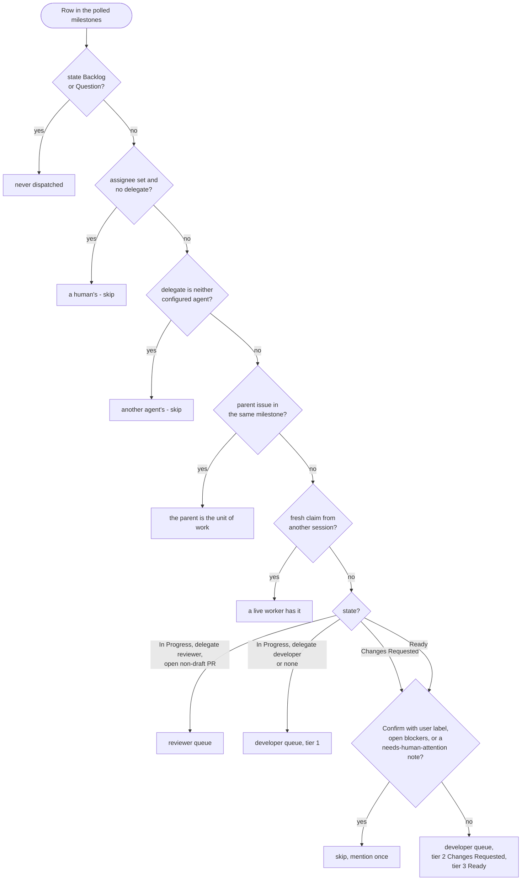

# The board model

The dispatcher works against a platform-neutral model of a task board. Linear
and GitHub Projects v2 each implement it; everything above the backend (the
CLI, the skills, the review sync) is written once against these ideas. This
page is the vocabulary the rest of the documentation uses.

## Issues, milestones and order

- **A task is an issue** in the one configured project. Its reference is the
  platform's: `ACM-12` on Linear, `#480` on GitHub. Every command accepts the
  reference in any case.
- **A milestone is a filter.** The dispatcher is scoped to the milestone set
  you name when you start it and never picks an issue outside it. Milestones
  are matched by name (Linear project milestones, GitHub milestones).
- **Manual board order is priority.** Nothing else ranks work: not creation
  date, not a priority field. The poll returns rows in board order, top of
  the board first, and the loop takes the topmost eligible row within a tier.

## The seven workflow roles

The dispatcher routes on **roles**. Your team's states can be called anything;
`dispatcher.config.json` maps each role to a state name (Linear) or a Status
option (GitHub), and every write resolves the name against the live board so a
rename shows up as "unknown state" instead of a silent write to the wrong
column.

| Role | Default name | Meaning | Who moves rows into it |
| --- | --- | --- | --- |
| `backlog` | Backlog | Not to be worked on yet, whatever else is true about the issue | you |
| `ready` | Ready | Agent-workable and never worked. Gets a fresh branch. | you (from Backlog or an answered Question) |
| `changesRequested` | Changes Requested | Worked and sent back. Always has an open PR to resume. Outranks Ready. | the reviewer's verdict, the review sync, the dispatcher |
| `inProgress` | In Progress | A developer or the reviewer holds it; which one is the delegate | the dispatcher |
| `question` | Question | Parked on a decision only you can make; the question is a comment on the issue | the worker that parked it |
| `humanReview` | Human Review | A PR is waiting on you | the dispatcher, after a passing review |
| `done` | Done | Merged. A Linear state of type `completed`. | your merge, through the board's GitHub integration |

Three rules follow from the table:

- **There is no review state.** A row stays `In Progress` from dispatch until
  it is ready for you; whether a developer or the reviewer holds it is the
  delegate's job. That keeps the state column about the human-facing
  pipeline: `Human Review` means you have something to do, `Question` means
  you have something to answer, everything else is machinery.
- **`Ready` and `Changes Requested` are different kinds of work.** `Ready`
  means "never touched": the developer cuts a fresh branch. `Changes
  Requested` means "there is an open PR with review threads on it": the
  developer resumes that branch and never opens a second PR. Nothing ever
  moves a worked row back to `Ready`.
- **`Done` is a merge event.** `dispatcher board state <ref> done` refuses on
  any issue without a parent, so an agent cannot complete a task by hand.
  The PR's `Fixes <ref>` line (and the `task/<ref>-...` branch name) is what
  links it to the issue, and the merge completes the issue.

A state the config does not name (a `Canceled` state, a column added later)
has role `null`. The dispatcher leaves such rows alone and the review sync
never rolls them back.

## Labels

Two labels are keyed on, again by configurable name:

| Label | Default | Meaning |
| --- | --- | --- |
| `confirmWithUser` | `Confirm with user` | Agent-workable, but you want a check-in before it starts. The loop skips it and mentions it once. Different from a human-assigned row, which is skipped outright. |
| `ui` | `UI` | Design-sensitive frontend work. Carried into the worker prompt so project-specific design rules apply. |

Parked questions used to be a label and are now the `Question` state; the CLI
refuses to write a label named `question` and says why.

## Delegate and claim

Two things together say who holds a row, and the loop needs both because they
answer different questions.



- **The delegate** is the agent identity the row is delegated to, the
  developer or the reviewer (the two `linear.agents` ids). It says which
  agent *phase* the row is in and survives between sessions: a row delegated
  to the reviewer with no claim is queued for a review, whichever dispatcher
  runs next. On Linear it is the platform's own delegation feature, so the
  owning agent shows in the assignee UI.
- **The claim** is one comment on the issue naming the worker role, the
  Claude Code session id, and a UTC-minute timestamp. It says which *session*
  is working the row right now. It is re-stamped every firing (edited in
  place, not re-posted) so it doubles as a heartbeat, and a claim older than
  the staleness window (90 minutes by default) belongs to a session that
  died. [Claims and sessions](claims.md) has the full mechanics.

| Row reads | Meaning | Loop action |
| --- | --- | --- |
| `In Progress`, delegate developer, no or stale claim | queued for a developer | dispatch a developer |
| `In Progress`, delegate reviewer, no or stale claim | queued for a review | dispatch a reviewer |
| any state, fresh claim | a live session has it | leave alone |
| `Human Review` or `Question`, no delegate | yours | leave alone |

Three commands move these: `claim` (a session is about to work the row),
`assign` (hand the row to the next agent phase with nobody on it, the
developer-to-reviewer handoff), and `release` (the agent pipeline is done
with it, or it is going back to a queue).

## Who owns a row: assignee read with delegate

Delegating a row on Linear also sets its assignee to the account the API key
belongs to. So an assignee on its own says nothing; **a row is a human's when
it has an assignee and no delegate.** That is the rule everywhere, and it is
why `release` clears the assignee together with the delegate: Linear leaves
the assignee behind when a delegate is cleared, and a row left like that
would read as human-owned forever and never be dispatched again.

A row delegated to an agent that is not one of the two configured ones is
somebody else's: not a human's, and not ours. The loop skips it, and
`claim` and `assign` refuse to move such a delegate, the same way `release`
refuses to clear it.

## Eligibility

Whether the loop may dispatch a row, given the milestone set it was started
with:



"Blocked" means an open issue blocks this one, and an issue stays open until
its PR merges, so a dependency sitting in `Human Review` keeps its dependents
unpickable. That is intended: it stops workers building on unmerged work they
would not have in their branch anyway.

## What the poll shows

`dispatcher board poll <milestone>...` prints one tab-separated line per open
issue, in board order:

```
milestone  state  delegate  claim  issue  labels  assignee  blockers  prs  parent  subs  title
```

The milestone column leads so a mis-scoped poll is visible at a glance. The
delegate sits next to the state because the two are read together. `claim`
shows `dev:<session>@<stamp>(<age>m)`. `prs` lists the pull requests the
board has linked; a PR whose branch and body both missed the identifier is
found with `dispatcher board pr-issues <pr>` and attached with `link-pr`.
`parent` and `subs` (`closed/total`) only populate on tasks created under an
older model that still carry sub-issues; see [Task lifecycle](lifecycle.md).
