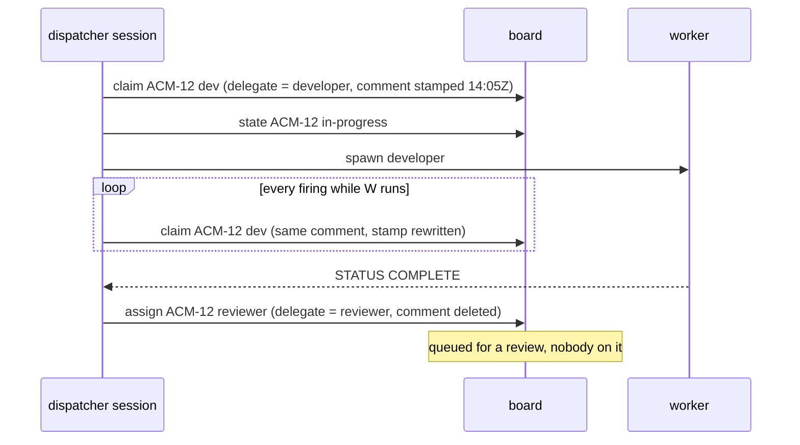

# Claims and sessions

Several workers run at once, and several dispatcher sessions may run against
the same board. The **claim** is what stops two of them working the same
issue, and it is also how a row survives the session that was working it
dying.

## Anatomy of a claim

A claim is two writes, made together by `dispatcher board claim <ref> <dev|review|cleanup>`:

1. **The delegate.** The issue is delegated to the role's agent identity: the
   developer agent for `dev` and `cleanup`, the reviewer agent for `review`
   (two identities for three roles, mirroring the two GitHub Apps, where the
   cleaner already commits under the developer app). On Linear this is the
   platform's own agent delegation, so the owning agent shows in the assignee
   UI. On GitHub Projects it is the `Claimed By` text field.
2. **The claim comment.** One comment on the issue:

   ```
   **[developer]** claimed 2026-08-27T14:05Z · `claude --resume eded70f3-9199-411f-b7a0-62a6df8eabb4`
   ```

   The role tag carries the role the delegate cannot (`developer`,
   `reviewer` or `cleaner`); the UTC-minute stamp is what staleness is
   measured on; and the resume command is exactly what you paste into a
   terminal to open the session that holds the row.

The delegate is written first. If the comment write then fails, the row shows
an agent holding it with no session, which the stranded-row scan treats as
claimable; the opposite order would leave a claim on a row that looks unheld.

The session id comes from the `CLAUDE_CODE_SESSION_ID` environment variable,
which the CLI reads itself. If it is empty the claim reads
`unknown-<random>` and the skill says so.

## The claim is a heartbeat

The dispatcher re-claims every row it still has a worker on, every firing. The
CLI finds the existing claim comment and edits it in place, so a worker that
runs for hours leaves one line on the issue, not a thread, and the stamp in
that line moves forward each time.

Age is measured **from the stamp in the comment text**, never from the
platform's own `updatedAt` of the comment. That is deliberate: the heartbeat
has to be a value this tooling writes and reads, or staleness would rest on
how a platform timestamps a comment edited in place, and a live claim that
stopped ageing forward would be stolen by the next dispatcher, putting two
workers on one row, which is the single failure the claim exists to prevent.



## Staleness and stealing

A claim whose session id is not this session's and whose stamp is older than
the staleness window belongs to a session that died. The window is
`claimStaleMinutes` in the config, 90 by default. The dispatcher takes such a
row: it claims it itself (the CLI reports what it replaced) and says in its
status text that it stole a stale claim from `<session-id>`. It never steals a
fresh claim, and a session's own claim is never stale to it.

Claims are last-writer-wins on every platform, so the rule is: poll, then
claim from that poll, never from an earlier turn's read.

`dispatcher board claims` lists every claimed and queued row in the project,
plus every `Question` row, marking each:

| kind | Meaning |
| --- | --- |
| `own-claim` | this session's; a worker is running |
| `claim` | another live session's; leave it alone |
| `stale-claim` | older than the window and not ours; take it or release it |
| `queued` | a delegate with no claim comment: handed to an agent, nobody on it yet |
| `question` | a row at `Question`, waiting on you |

## claim, assign, release

| Command | Delegate | Claim comment | Use it when |
| --- | --- | --- | --- |
| `board claim <ref> <role>` | set to the role's agent | written or re-stamped | a session is about to start (or is still running) a worker |
| `board assign <ref> <developer\|reviewer>` | moved | deleted | handing the row to the next agent phase with nobody on it: the developer-to-reviewer handoff, or bouncing an unready row back to the developer |
| `board release <ref>` | cleared, along with the assignee it dragged in | deleted | the agent pipeline is done with the row (Human Review, Question) or it is going back to a queue (Changes Requested) |

Exactly one of `assign` or `release` follows every processed worker result,
never both and never neither. Using `release` where the row should stay
delegated forgets which phase it is in: `In Progress`, undelegated and
unclaimed is developer tier 1, so a released review row would get a
*developer* sent at finished code whose review is owed.

`release` only clears a delegate that is one of the two configured agents. A
row you have taken over yourself, or one delegated to some other workspace
agent, is left alone, and `claim` and `assign` refuse to overwrite such a
delegate rather than silently take a stranger's row.

## More than one dispatcher

Two sessions can run against one board, scoped to the same or different
milestones:

- Each claims before spawning, so a row is taken by whichever polled and
  claimed first, and the other sees the fresh claim and moves on.
- Each re-stamps only its own claims and steals only stale ones.
- `/dispatcher:stop` releases with `--session <own id>`, which refuses to
  touch a claim belonging to a different session, so one dispatcher stopping
  never clears another's live worker. A row carrying no claim at all asserts
  no session, so the same call still clears a delegate left behind on its
  own.
- The event channel's waiter takes a lock; a second session's `dispatcher
  wait` reads `already-waiting` and that session runs on its timer alone.

## When a session dies

Nothing durable was in the session. Its claims age out; the next dispatcher's
stranded-row scan takes over a row whose review is owed, releases the others
and surfaces them; `dispatcher prune-worktrees` reclaims a worktree whose lock
names a process that no longer exists, provided it holds nothing uncommitted
or unpushed. Work the dead session's developer committed and pushed is on its
branch, and a `Changes Requested` or `In Progress` row points the next
developer at it.
