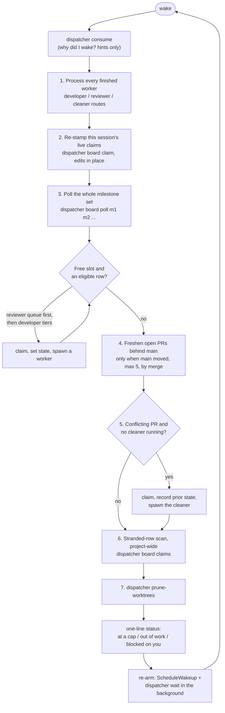
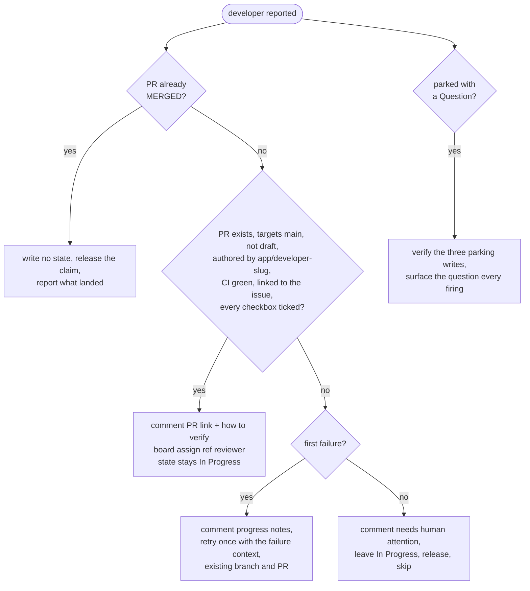
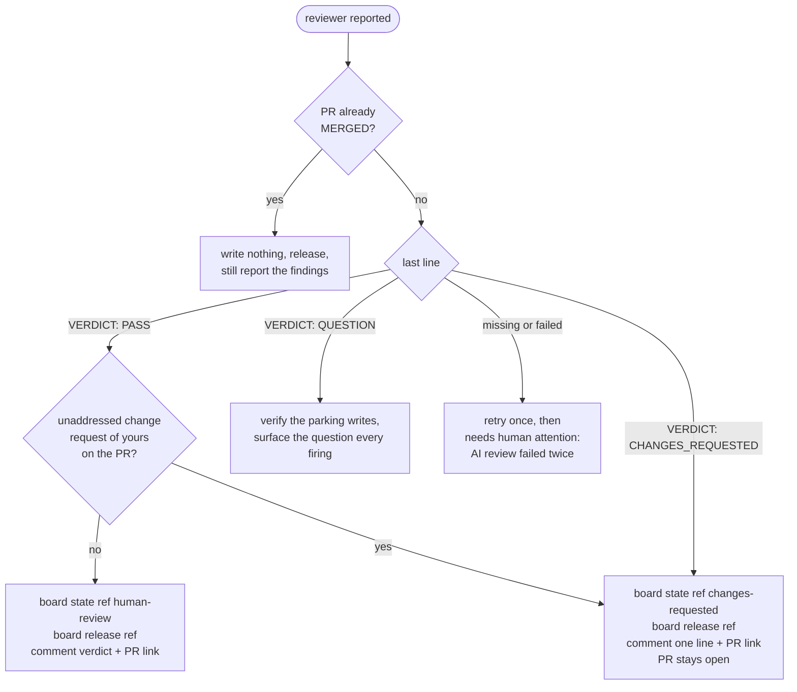

# The dispatcher loop

`/dispatcher:start` runs in one Claude Code session as a self-paced loop. The
session stays lightweight and long-lived; every task is executed by a fresh
subagent. The dispatcher only polls, claims, spawns, verifies, updates the
board, and paces itself.

## How the loop is driven

The loop is Claude Code's dynamic `/loop` mode. After each firing the
dispatcher arms the next one with a fallback timer, and three things can wake
it earlier:

| Wake signal | Source | Typical latency |
| --- | --- | --- |
| Worker completion | a subagent finishing (harness-tracked) | immediate |
| Event channel | the background `dispatcher wait` exiting because a board or PR event arrived | seconds |
| Fallback timer | `ScheduleWakeup`: 1800 s while workers run, 60 s when the milestone set is drained | minutes |

The re-arm prompt carries every milestone in scope and the last `main` commit
the freshness sweep saw, so a firing that runs after the session's context was
summarized still knows its scope and whether `main` moved.

## One firing

Two habits the skill insists on, because they are the ones that quietly stop
happening hours into a session:

- **Poll every firing, even when nothing finished.** The board changes
  underneath the loop: you merge, promote rows, send tasks back, reorder.
- **Top up until a cap or out of work.** Processing one completion and
  ending the turn leaves the loop running one worker at a time while rows
  sit untouched.

The skill also makes the dispatcher re-invoke the companion skill
(`spawn-developer`, `spawn-reviewer`, `spawn-cleaner`) at each decision point
rather than working from memory of the long start skill; the steps that are
skipped in practice are the ones recalled hours later.

## Selection

Both queues are filled from one poll of the milestone set, in board order,
after the [eligibility rules](board-model.md#eligibility).

**Reviewer queue first** (cap 2). A review is short and unblocks you, and a
stalled review queue leaves finished work invisible. Eligible: rows delegated
to the reviewer, unclaimed or stale-claimed, with an open non-draft PR. A
delegated row with no PR at all gets a "needs human attention" comment and is
skipped; one with a draft PR, unticked checkboxes or unfinished legacy
sub-issues is handed back to the developer (`board assign <ref> developer`)
because there is nothing to review yet.

**Developer queue** (cap 2), in strict tier order; a lower tier is only
considered when the higher one has no eligible row:

1. A row already `In Progress`, delegated to the developer or undelegated,
   and unclaimed or stale-claimed. Finish what a dead session started.
2. The topmost eligible `Changes Requested` row.
3. The topmost eligible `Ready` row.

Board order ranks rows within a tier only. A `Ready` row that somehow has an
open PR is a board error: it is treated as rework and moved to `Changes
Requested`. A `Changes Requested` row with no PR is the opposite error and gets
a "needs human attention" comment.

## Dispatching

1. Read the issue in full: `dispatcher board issue <ref>` (description,
   checkbox list, sub-issues, blockers, the latest comments including your
   answer to a parked question). On a resume, read every review surface on
   the PR, yours included.
2. Claim, then set the state: `dispatcher board claim <ref> dev` (or
   `review`, `cleanup`) and `dispatcher board state <ref> in-progress`.
   Claiming before spawning is what closes the race between two dispatchers.
3. Spawn the agent: `dispatcher:developer` with worktree isolation,
   `dispatcher:reviewer` without one (it must never have a working tree to
   mutate), `dispatcher:cleaner` with worktree isolation. The prompt comes
   from the companion skill's template: the task, the branch name computed by
   the dispatcher, the project's install and quality-gate commands from its
   CLAUDE.md, the standing prohibitions, and the report format.

The caps: 2 developers, 2 reviewers, 1 cleaner in its own slot, 5 workers in
total. If two developers' test runs ever collide on a shared resource, the
developer cap drops to 1 and the status text says so.

## Routing a developer's result

"Verify, don't trust" is the rule: a COMPLETE report with no open PR, an
unticked box, or a PR opened under your own account (which you could never
approve) is INCOMPLETE. Follow-up work a worker describes is relayed to you in
the status text and never filed as an issue; only you create issues.

## Routing a reviewer's verdict

Your own review outranks the AI's. Before promoting anything the dispatcher
reads the PR's reviews and comments, filters out the reviewer bot's by login,
and treats whatever remains with a body as yours. There is no cap on review
round-trips; review and fix rounds alternate until the PR honestly passes or
you step in.

## Routing a cleaner's result

Restore, never promote. A row that was at `Human Review` was already reviewed
for its feature; one at `Changes Requested` still owes you its change
requests. If any file needed manual resolution the row is handed to the
reviewer for a merge-scoped review (`board assign <ref> reviewer`); if nothing
actually conflicted, the state and delegate it came from are put back. A
conflict a fresh worker cannot honestly resolve is two features disagreeing,
and the cleaner parks that as a Question. See [Workers](workers.md#cleaner).

## Maintenance that runs every firing

**Freshen open PRs.** Every merge you make leaves every other open PR one
commit further behind `main`, its green CI stale and its conflicts latent. When
`main` has moved since the last sweep, the loop measures each open PR with
`compare` (never `mergeStateStatus`, which reads `CLEAN` on repositories that
do not require up-to-date branches), and brings up to five of the most-behind
ones up to date **by merge, through the developer app's token**, so the merge
commit is the bot's. It skips your own PRs, drafts, and any branch checked out
in a local worktree; it never rebases or force-pushes. A `422` means the branch
conflicts, and the PR goes to the cleaner instead.

**Dispatch the cleaner.** The conflict scan enumerates open PRs (not board
rows, because a conflicting PR usually belongs to a `Human Review` issue no
board query surfaces), re-queries `mergeable` because GitHub computes it
lazily, and dispatches the single cleaner at the most-behind conflicting PR
that is not a draft, not held by a worktree, and not already being worked.

**Scan for stranded rows.** `dispatcher board claims` lists every claimed,
queued and parked row in the whole project, ignoring the milestone scope. A
`stale-claim` row delegated to the reviewer with an open PR gets its review
dispatched whatever milestone it is in; other stale claims are released and
surfaced. Every `question` row is surfaced. This is what catches a row a dead
session left in a milestone nobody is polling.

**Prune worktrees.** `dispatcher prune-worktrees` removes every finished agent
worktree, keeping any that is locked by a running agent, holds uncommitted
files, or has unpushed commits ([Worktrees](worktrees.md)). It runs every
firing, not only after completions, because a loop with no workers running
would otherwise never prune.

## What the status text must say

Every firing ends in exactly one state, and the status line names it:

| State | Meaning |
| --- | --- |
| At a cap | 2 developers or 2 reviewers in flight; lists what is running |
| Out of work | polled this firing, nothing eligible; says why |
| Blocked on you | rows at `Human Review`; the PR count comes from `gh pr list --state open`, separately from the row count |

Counts come from a query in the same turn, never from memory. "Idle with
`Changes Requested` or `Ready` rows available and a free slot" is never a valid
end state.

## Stopping

`/dispatcher:stop` ends the loop's wakeups, stops the event waiter, drains
(default) or aborts (`now`) the in-flight workers, restores each row to an
honest state, releases this session's claims with `board release <ref>
--session <id>` so another live dispatcher's claims are never touched, and
reports. A `review` claim is restored with `board assign <ref> reviewer`
rather than released, so the review that is owed is not forgotten.
