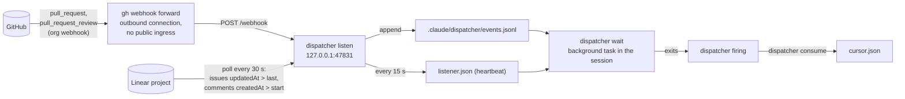
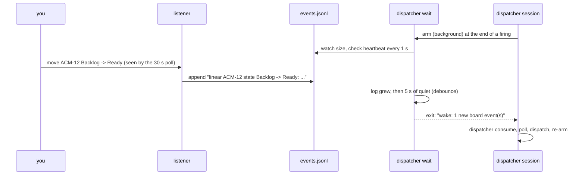

# Event channel

Polling on the wakeup timer is the reliable floor, but it makes a board change
wait out the timer. The event channel closes that gap. It is an accelerator,
never a dependency: every piece of it can be down, stale or unconfigured and
the loop runs exactly as documented, at polling latency.

## The pieces

**`dispatcher listen`** runs in its own terminal and serves every session on
the machine. It:

- binds a loopback port (47831 by default; `listener.port` in the config
  overrides it, which matters when several dispatcher-enabled repositories
  share one machine);
- spawns and supervises `gh webhook forward --org=<repository owner>` for
  the pull request events, restarting it with exponential backoff when it
  dies (network drop, laptop sleep) and recording the failure in its
  heartbeat instead of exiting;
- on Linear, polls the project every 30 seconds (Linear webhooks need public
  ingress, so the listener asks instead), diffs the fields the dispatcher
  routes on against a cache, and appends one event per real change plus one
  per new comment;
- appends accepted events to `events.jsonl` and refreshes `listener.json`
  every 15 seconds and after every delivery.

**`dispatcher wait`** is armed by the dispatcher as a background task at the
end of every firing. It blocks until new events land in the log, then exits,
and the exit is a wake exactly like a worker finishing. It never consumes
anything.

**`dispatcher consume`** runs at the start of every firing. It prints the
events since the last consume and advances the cursor. The summaries are hints
about why the loop woke; the poll remains the source of truth and runs
regardless.

**`dispatcher status`** reports listener liveness (fresh heartbeat plus a live
pid), forward-channel health, Linear poller health, and the unconsumed event
count. Exit 0 means up, 1 means down.

## What counts as an event

Deliveries are filtered before they are logged, so the channel cannot wake the
loop with its own noise:

| Source | Accepted | Dropped |
| --- | --- | --- |
| GitHub `pull_request` | opened, reopened, closed (merged or not), ready_for_review, converted_to_draft | any sender of type `Bot` or ending in `[bot]` (the agent apps' own pushes and reviews); other actions |
| GitHub `pull_request_review` | submitted, with the state and reviewer | bot senders; edited, dismissed |
| Linear issue poll | changes to state, assignee, labels, milestone, order, parent, linked PRs, title; new open issues | anything else; closed issues that appear for the first time |
| Linear comment poll | new comments, with author and first line | the dispatcher's own claim comment |
| GitHub board (`platform: github` only) | `projects_v2_item` moves, `issues` state and label changes, `issue_comment`, `sub_issues` | edits to the `Claimed By` field (the claim heartbeat) |

State writes and delegate writes the dispatcher itself makes do echo back as
events; the resulting extra firing is cheap and expected (it consumes, polls,
finds nothing new, re-arms).

## How a wake plays out

The dispatcher routes on the first line of the waiter's output:

| First line | Meaning | Then |
| --- | --- | --- |
| `wake: N new board event(s)` | something changed | a normal firing |
| `timeout: ...` | nothing arrived within the wait (default 29 minutes) | a normal firing; re-arm freely |
| `channel-down: <reason>` | no listener, stale heartbeat, or dead pid | do not re-arm the waiter this firing; the loop runs on its timer alone and tries again once `status` reads up |
| `already-waiting: pid N` | another session's waiter holds the lock | do not arm one; that session gets the wake |

The channel-down rule is what prevents a wake loop: `wait` exits immediately
when the listener is down, so re-arming it in the same firing would spin. The
fallback timer is re-armed every firing no matter what.

## State on disk

Everything lives in one gitignored directory, `.claude/dispatcher/` beside the
nearest `dispatcher.config.json` at or above the working directory (override
with `--dir` or `DISPATCHER_STATE_DIR`):

| File | Written by | Purpose |
| --- | --- | --- |
| `events.jsonl` | listener | append-only log, one event per line |
| `cursor.json` | `consume` | byte offset the dispatcher has consumed up to |
| `listener.json` | listener | heartbeat: pid, port, forward and poller state, counters; removed on a clean stop |
| `waiter.json` | `wait` | the active waiter's lock (pid) |

A heartbeat older than 60 seconds, or one whose pid is gone, reads as down. A
crashed listener therefore reads as down within a minute and nothing has to
clean up after it. The config file is the root marker on purpose: a git
worktree under `.claude/worktrees/` carries its own copy of the config, so the
walk stops there and a worker never shares the main checkout's state
directory.

## Degradation, by design

- No `gh webhook` extension or missing `admin:org_hook` scope: the forward
  child fails, the listener records the error and keeps retrying with
  backoff, and the loop runs on polling and the Linear side alone.
- No Linear API key: the listener starts with Linear polling off (`status`
  says why) and records PR events only.
- No listener at all: `consume` prints "no pending events", `wait` returns
  `channel-down`, and nothing else changes.

Setting it up is in [Event channel setup](../setup/event-channel.md).
