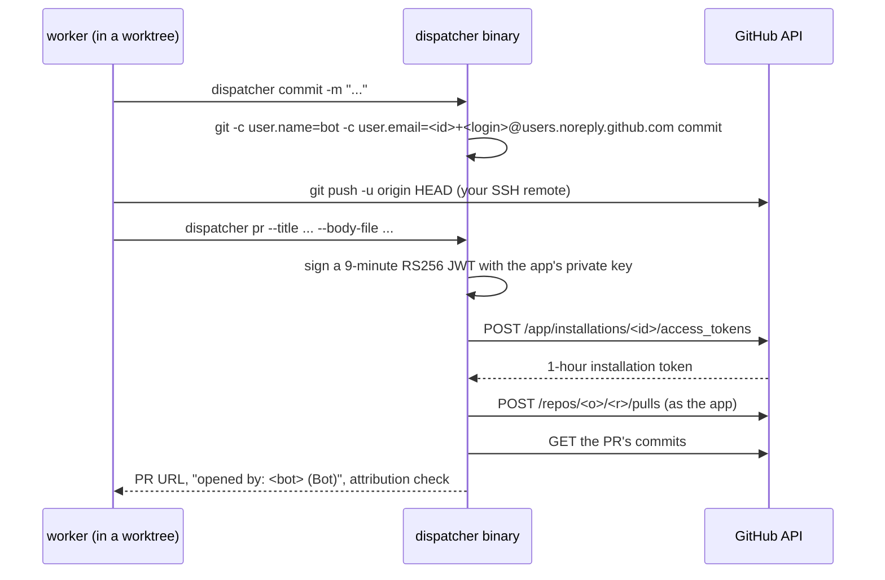

# Two agent identities

GitHub refuses to let an account approve its own pull request. If agents
committed and opened PRs under your account, every PR they produced would be
one you could never approve, and the review surface the whole workflow exists
to provide would be gone. So agent work is done as two GitHub Apps:

| App | Role | What it does | Used by |
| --- | --- | --- | --- |
| **developer** | `githubApps.developer` | authors every agent commit, opens every agent PR, and is the identity the freshness sweep's merge commits land under | `dispatcher commit`, `dispatcher pr`, `dispatcher token` (default) |
| **reviewer** | `githubApps.reviewer` | posts the adversarial review on the PR | `dispatcher token --app reviewer` |

Two, not one, because a review from the account that wrote the code is not an
independent signal, and GitHub rejects a formal review from a PR's own author
outright.

## What each command does

- **`dispatcher commit`** runs `git commit` with the developer bot's author
  identity set through per-invocation `-c` flags, never repository config, so
  your own commits keep your identity. The email is
  `<botUserId>+<botLogin>@users.noreply.github.com`; GitHub matches a
  noreply address on the numeric id prefix, and the id (unlike the login or
  slug) survives an app rename.
- **`dispatcher pr`** mints an installation token for the developer app and
  creates the PR through the REST API directly. It does not shell out to `gh
  pr create` because `gh` resolves the current user via `GET /user`, which
  does not exist for an installation token (bots are not users). After
  creating the PR it reports who GitHub recorded as the author and lists any
  commit not attributed to the bot, which is how a stray plain `git commit`
  gets caught before the PR reaches you. It refuses to open a PR from the base
  branch into itself.
- **`dispatcher token [--app <role>]`** prints a one-hour installation token
  and nothing else, so it can be scoped to a single command:
  `GH_TOKEN="$(dispatcher token --app reviewer)" gh api ...`. Tokens are never
  cached; minting is one round-trip. A bare `--app` with no role is an error
  rather than a fall back to the developer, so a typo can never hand a review
  the identity that wrote the code.
- **`dispatcher identity [--app <role>]`** prints the installation's granted
  permissions, account, repository selection, the bot login and the git email
  the app expects, for diagnosing permission gaps.

Pushing stays on your normal `origin` remote: who pushed has no bearing on
commit attribution (author email) or PR authorship (creating token).

## Rules the workflow keeps around the identities

- The reviewer only ever posts `event: "COMMENT"` reviews. GitHub would accept
  an `APPROVE` from the reviewer bot, and that approval could satisfy a
  required-review rule and make agent-written code look human-approved. The
  verdict travels on the report's last line instead.
- The reviewer uses `gh api`, not `gh pr review`, under its token, and scopes
  `GH_TOKEN` to the one command. If `dispatcher token --app reviewer` fails,
  it stops and reports rather than falling back to your auth: a review under
  the wrong identity burns the human review slot and is hard to tell apart
  afterwards.
- The freshness sweep updates branches through the developer app's token so
  the merge commit is the bot's, and only touches bot-authored PRs.
- The dispatcher verifies a finished PR's author is `app/<developer-slug>`
  before handing it to review; one opened under your account is sent back to
  be reopened with `dispatcher pr`.
- The review sync ignores reviews from either bot's user id (`botUserIds`),
  so an AI verdict can never drive the board without you in the loop.

## Where the keys live

Each app's private key is a PEM file read from `.secrets/<slug>.private-key.pem`
in the main checkout (found through `git rev-parse --git-common-dir`, so it
resolves from any worktree), or from the environment variable named in the
app's `keyEnvVar` (default `DISPATCHER_GITHUB_APP_KEY_DEVELOPER` /
`..._REVIEWER`). `dispatcher init` checks both and tells you which is missing.
Setting the apps up is described in [Set up the GitHub Apps](../setup/github-apps.md).
