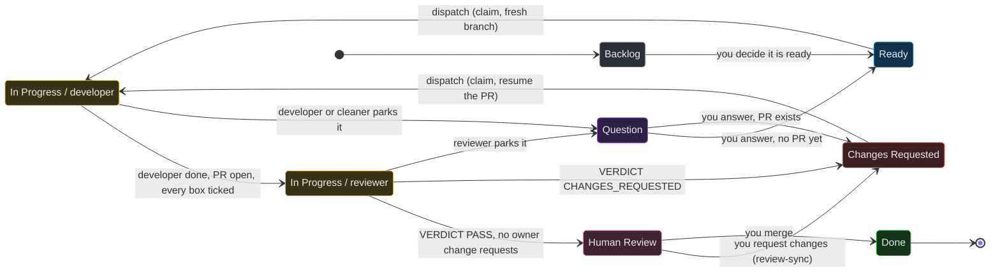

# Task lifecycle

## Every transition, and who makes it

| From | To | Written by | Trigger |
| --- | --- | --- | --- |
| Backlog | Ready | you | you decide the task is ready to be worked |
| Ready | In Progress (delegate developer) | dispatcher | dispatch: `board claim <ref> dev` then `board state <ref> in-progress` |
| In Progress (developer) | In Progress (delegate reviewer) | dispatcher | the developer reported COMPLETE, the PR exists, is authored by the developer app, is linked to the issue, CI is green, and every checkbox is ticked: `board assign <ref> reviewer` |
| In Progress (reviewer) | Human Review | dispatcher | `VERDICT: PASS` and no unaddressed change request of yours on the PR: `board state <ref> human-review`, `board release <ref>` |
| In Progress (reviewer) | Changes Requested | dispatcher | `VERDICT: CHANGES_REQUESTED`, or a PASS overridden by your own change request: `board state <ref> changes-requested`, `board release <ref>` |
| Human Review | Changes Requested | review sync (CI) | you submit a "Request changes" review on the PR |
| Changes Requested | In Progress (developer) | dispatcher | dispatch, resuming the existing PR and branch |
| In Progress | Question | the worker | it hit a decision only you can make: comments the question, `board state <ref> question`, `board release <ref>` |
| Question | Ready or Changes Requested | you | you reply on the issue and move the row |
| Human Review | Done | your merge | the board's GitHub integration completes the linked issue |

Two things are never written by any agent: `Done` on a top-level task (the CLI
refuses it) and any move out of `Backlog` or `Question`.

## Rework goes to Changes Requested, never back to Ready

`Ready` means a fresh branch. Everything that sends work back, the reviewer's
verdict, your change request, a review that passed but left your own comments
unaddressed, lands in `Changes Requested`, because there is an open PR whose
branch and review threads the next developer has to resume. The developer adds
commits to that PR, replies to each thread it addressed, and never force-pushes
(a force-push marks every review thread outdated).

`Changes Requested` also outranks `Ready` in the developer queue. A sent-back
task has a PR you are waiting on; starting a new task ahead of it widens the
pile of half-finished PRs.

## Questions

A worker runs in the background with no way to reach you mid-task. When it
catches itself wanting to ask, the point where an interactive session would
stop, it parks the task instead of guessing:

1. Comments the question on the issue, tagged with its role, written for
   someone who was not there: the decision, the options with consequences,
   and its recommendation.
2. Sets the state to `Question`.
3. Releases its claim, which clears the delegate too, so the row does not read
   as an agent still holding stopped work.
4. Pushes what it built and opens a draft PR if there is anything worth
   showing.

The dispatcher surfaces the question in its status text, in full, every firing
until you answer. You answer by replying on the issue and moving the row to
`Ready` (never worked) or `Changes Requested` (a PR exists). The next worker's
prompt carries both the question and your reply verbatim. A row moved out of
`Question` without a reply is not dispatched; the dispatcher says so.

Parking is for genuine owner decisions: an ambiguous requirement with two
defensible readings, a product call, a change that would break something you
may depend on, a premise that looks wrong. Anything a worker can settle by
reading the code, or that has an obvious default, it decides and states the
assumption in its report and PR body.

## One task, one branch, one PR

The unit of dispatch is a top-level task, and a task is always exactly one
branch and one pull request, however the work is broken down inside it.
Multi-step work is a **markdown checkbox list in the issue description**; the
developer ticks each box the moment that piece is written and its tests pass,
and the dispatcher does not hand the task to the reviewer while a box is
unticked. Editing the description for that is the one sanctioned edit a
worker makes to an issue.

An issue description that says otherwise ("each piece is its own PR") is
overridden and flagged to you; split PRs have had to be consolidated back onto
one branch before.

## Linking the PR to the issue

`Done` is a merge event, so the PR must be linked to the issue or the merge
completes nothing. Two mechanisms, used together:

- The branch name `task/<identifier-lowercased>-<short-slug>`, computed by
  the dispatcher and given to the developer verbatim (`task/acm-480-chat-scroll-pinning`).
- The line `Fixes <IDENTIFIER>` in the PR body.

The poll's `prs` column shows what is linked. Before handing a task to the
reviewer the dispatcher checks the link and attaches a missed PR with
`dispatcher board link-pr <ref> <pr>`, and before concluding any row has no PR
it runs `dispatcher board pr-issues <pr>` over the open PRs, which resolves a
PR from any era: Linear's attachment, the identifier in branch or body, or the
GitHub issue number a task was imported from.

## Legacy sub-issues

Tasks created under an older workflow model may carry sub-issues. They are
tracking only, never dispatched on their own, and nothing creates new ones.
The developer sets a sub-issue `In Progress` when it starts that piece and
`Done` when it finishes it (allowed, because a sub-issue has a parent and no
PR of its own), the dispatcher reconciles the table against the developer's
report before review, and a sub-issue whose parent is in the milestone is
never picked. The poll's `parent` and `subs` columns and the `## Sub-issues`
table in `dispatcher board issue` are where this shows.

## Merges that land mid-flight

Worker results arrive minutes after the work they describe, and you may merge
in between. Every route that writes a state first re-checks the PR: if it
reads `MERGED`, the board is already correct (`Done`, via the integration),
the dispatcher writes nothing, releases the claim, and reports what landed.
