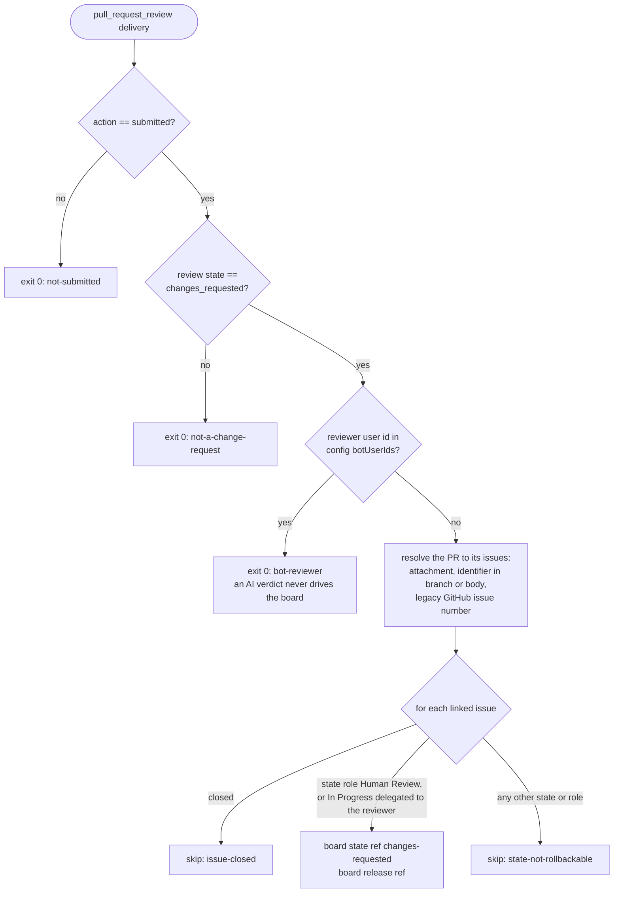

# Review sync

Promotion to `Human Review` is not the end of the review conversation. You
review the PR after it lands there, and if the only thing reading your reviews
were a dispatcher step, a change request left while no session was awake would
sit invisible: the row would look like it awaited a merge that you were in
fact waiting on the agents for. That happened, to three rows, two of them for
two days.

So the sync runs as a GitHub Actions workflow on GitHub's side, whether or not
anything local is running. Linear's own GitHub automation cannot do this: it
has states for a PR being opened, reviewed and merged, but no event for a
review that requests changes.

## What it does

`dispatcher review-sync` reads the `pull_request_review` payload GitHub wrote
to `GITHUB_EVENT_PATH`, decides whether to act, resolves the PR to its board
issues through the configured backend, and moves the ones in the review
conversation back to `Changes Requested`.

Two writes per moved row, in this order: the state, then a release. The
release is half of what "sent back" means: while a row is under review its
delegate is the reviewer agent, and writing only the state would leave
`Changes Requested` with the reviewer still holding it, which is exactly the
shape the reviewer queue dispatches. The next firing would spend a full AI
review round on work you had already rejected. Releasing clears the delegate
(and the assignee Linear leaves behind with it), so the row reads as rework
nobody is on, and the developer queue picks it up ahead of every `Ready` row.

## What it never does

- **Never roll back a row that is not in the review conversation.** The
  rollbackable set is an allow-list by role: `Human Review`, plus `In
  Progress` delegated to the reviewer. A `Done` row would be reopened; a
  developer's `In Progress` row would lose the fact that somebody is mid-fix;
  a state the workflow has never heard of is left alone rather than assumed
  safe.
- **Never act on a bot's review.** The reviewer app is forbidden from posting
  `CHANGES_REQUESTED`, but policy is not a mechanism; the user id check is.
- **Never fail quietly in the wrong direction.** A delivery it decides not to
  act on exits 0 with a one-line reason, because the workflow fires on every
  review and most are not change requests. A genuine API failure exits
  non-zero, so a broken sync shows as a red workflow run rather than a board
  that silently stops moving.

The decision logic is pure and unit-tested; the workflow only supplies the
payload and the credentials.

## What you see

Request changes on a PR at `Human Review`. Within seconds the issue reads
`Changes Requested` with no delegate, and the next dispatcher firing dispatches
a developer at it with your review carried into the prompt verbatim. The
dispatcher does not re-implement this as a poll: that would put the fix back
behind exactly the condition (a session being awake) the workflow exists to
remove.

Wiring it into your repository is in [Review sync workflow](../setup/review-sync.md).
