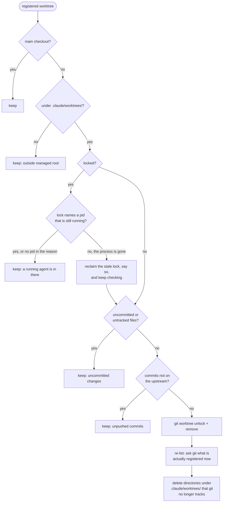

# Worktrees and pruning

Developers and cleaners run with worktree isolation: each gets its own git
worktree under `.claude/worktrees/`, so two workers never contend for one
working tree and can run at the same time. The reviewer never gets one; it
reads the PR through `gh` and `git show origin/<branch>:<path>` and mutates
nothing.

## Why removal is the dispatcher's job

A worktree keeps its task branch checked out after the agent exits, and git
refuses to check out one branch in two places. So every worktree left behind
makes its PR's branch un-checkoutable for you: you pull the branch up in your
editor and get a bare "failed to execute git". Left alone these accumulate,
one per finished task, until most open PRs cannot be reviewed locally. In a
real run 38 orphaned directories built up over three weeks.

The worker cannot fix this. A worktree-isolated agent is blocked from running
git against the main checkout, and a worktree cannot be removed from inside
itself. Whoever is left does it, which is the dispatcher, and it is one
command it runs every firing and after every worker report:

```sh
dispatcher prune-worktrees            # --dry-run to see the plan
```

## The rules



- **Never destroy work.** Removing a worktree deletes its files, so a
  worktree is only removed when nothing is uncommitted, untracked or
  unpushed. A worktree whose git metadata is already broken reads as holding
  work and is kept.
- **A lock means someone is in there, while they are.** Claude Code locks a
  running agent's worktree with a reason naming its pid. A lock whose pid is
  gone is a dead session's leftover holding the branch hostage; it is
  reclaimed, out loud, and the work checks still run. A lock with no pid in
  its reason says nothing about its holder and is left alone.
- **Sweep the husks.** On Windows, `git worktree remove` routinely
  deregisters the worktree and then loses the directory delete to an open
  file handle. The run never trusts that command's exit status: it re-lists,
  and any directory under `.claude/worktrees/` that git no longer tracks is
  deleted. `git worktree prune` alone would only clean git's bookkeeping.
- **Refuse to plan from nonsense.** A worktree list with no main checkout in
  it means the command failed; treating it as "nothing registered" would
  class every live worktree as an orphan.

The exit code is non-zero only when git still lists a worktree the prune tried
to remove. The dispatcher reports that, because it means something is holding
the branch and you cannot check it out.

## What a worker owes the pruner

Commit and push everything before reporting. Anything left uncommitted or
unpushed keeps the worktree alive, which keeps the branch un-checkoutable.
A developer that parks a task on a question pushes what it built as a draft
PR for the same reason; a cleaner that cannot honestly resolve a conflict
leaves the half-merge un-pushed on purpose, and the pruner keeps that worktree
until you decide.

The keep rules are enforced in code and covered by unit tests in the
dispatcher repository rather than restated in the skills, because prose at
the end of a long loop is not a guarantee.
