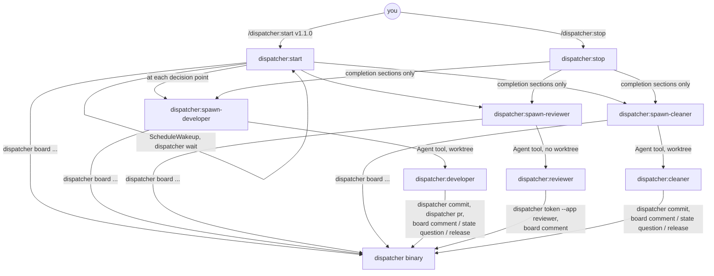

# Claude Code plugin

The plugin is the half of the dispatcher that runs inside Claude Code. It is
published from this repository as the `dispatcher` marketplace and enabled
per repository; `dispatcher init` writes the two entries into
`.claude/settings.json`:

```json
{
  "extraKnownMarketplaces": {
    "dispatcher": { "source": { "source": "github", "repo": "backside4charter/dispatcher" } }
  },
  "enabledPlugins": {
    "dispatcher@dispatcher": true
  }
}
```

A running session picks the plugin up after a restart. The skills expect the
`dispatcher` binary on the `PATH`; a project may wrap it (a `just` recipe, a
script) and say so in its CLAUDE.md, and the arguments are identical.

## Skills

| Skill | Invoke | What it does |
| --- | --- | --- |
| `dispatcher:start` | `/dispatcher:start <milestone> [<milestone> ...]` | the loop: scope, the board model, eligibility, claiming rules, concurrency caps, the iteration protocol, worker completion routing, the freshness sweep, reporting rules, hard rules. Read once at loop start |
| `dispatcher:stop` | `/dispatcher:stop [now]` | shuts the loop down in the session running it: ends the wakeups, stops the waiter, drains or aborts workers, restores rows, releases this session's claims, reports |
| `dispatcher:spawn-developer` | invoked by the loop | the developer procedure: selection tiers, reading the issue and its checkbox list, reading every review on a resumed PR, claim-then-spawn, the prompt template, verification and routing on completion, worktree release |
| `dispatcher:spawn-reviewer` | invoked by the loop | the reviewer procedure: selection, CI-finished check, writing a review prompt that targets real risk, the prompt template, merged-PR check and verdict routing |
| `dispatcher:spawn-cleaner` | invoked by the loop | the cleaner procedure: scanning open PRs for conflicts, re-querying `mergeable`, skips, claim and record the prior state, the prompt template, restore-not-promote routing; also the project-wide stranded-row scan |

The three `spawn-*` skills exist so the procedures load fresh at the decision
point rather than being recalled from the long start skill hours later.

## Agents

| Agent | Subagent type | Model | Isolation | Tools |
| --- | --- | --- | --- | --- |
| developer | `dispatcher:developer` | opus, effort xhigh | worktree | all |
| reviewer | `dispatcher:reviewer` | opus, effort xhigh | none | all except `Edit`, `Write`, `NotebookEdit` |
| cleaner | `dispatcher:cleaner` | opus, effort xhigh | worktree | all |

The agent definitions carry the invariants that hold regardless of the prompt:
scope, isolation, branch and PR rules, identity, the board writes each may
make, the question-parking flow, the report format. The prompt the dispatcher
builds from the companion skill's template carries the task itself. If a
worker type is not available in a session, the loop tells you to restart the
session rather than falling back to a general-purpose agent, which would
inherit the dispatcher session's weaker model and, for review, its write
tools.

## How the pieces call each other



## Session mechanics worth knowing

- **Session id.** `CLAUDE_CODE_SESSION_ID` is what claims record; `claude
  --resume <id>` reopens the session that holds a row. `/dispatcher:stop`
  has to run in that session because wakeups, background tasks and subagents
  are all session-local.
- **Wakes.** Worker completions are task notifications; the event channel's
  `dispatcher wait` is a background Bash task whose exit is a notification;
  `ScheduleWakeup` is the fallback timer. The re-arm prompt carries the
  milestones and the last swept `main` commit so a firing after context
  summarization keeps its scope.
- **Models.** Run the dispatcher session on a strong model at low effort
  (`claude --model opus --effort low`); the workers pin their own model and
  effort.
- **Worktrees.** Developer and cleaner agents are spawned with worktree
  isolation and end up under `.claude/worktrees/`; the dispatcher prunes them
  with `dispatcher prune-worktrees` every firing.

## Files in the plugin

```
.claude-plugin/plugin.json        name, version, description
.claude-plugin/marketplace.json   the marketplace listing this plugin
skills/start/SKILL.md
skills/stop/SKILL.md
skills/spawn-developer/SKILL.md
skills/spawn-reviewer/SKILL.md
skills/spawn-cleaner/SKILL.md
agents/developer.md
agents/reviewer.md
agents/cleaner.md
```
